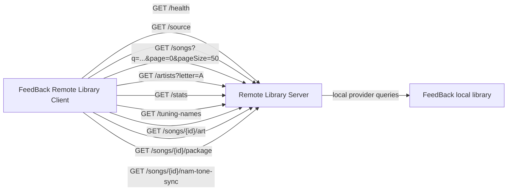

# Remote Library Server

Remote Library Server is a source-side [FeedBack](https://github.com/got-feedback/feedBack) plugin for sharing the current FeedBack local library over a small direct HTTP API. It runs on its own port, separate from FeedBack's main backend, and is designed to be consumed by the [Remote Library Client](https://github.com/Taynavv/feedback-remote-library-client) plugin.

The direct server is a thin wrapper around FeedBack's `local` library provider. It does not build or publish a second catalog of its own; the songs, filters, sort order, artwork, and package downloads reflect what the local FeedBack library provider exposes.

## Runtime Model

The plugin declares the core `library` capability as a requester/observer. Its manifest uses `requests` for public library owner commands (`list-providers`, `get-current`, `inspect`) and `observes` for source lifecycle events (`providers-refreshed`, `source-changed`). It uses FeedBack's existing `local` provider through the library provider registry, but it does not own the `library` domain and does not register itself as a `library` provider. The Remote Library Client is the plugin that should appear as a `library` provider when it registers a remote source.

Management stays on the plugin's existing screen and backend routes rather than capability commands. The capability declaration exists so diagnostics and the bundled Capability Inspector show that this server depends on the library surface it wraps.

## What It Does

- Starts a direct library server on a configurable host and port.
- Waits for FeedBack's startup library scan to finish before autostarting, so it does not race the local index.
- Lists local feedpak packages (including legacy `.sloppak`) as remote song summaries using paged provider queries.
- Supports the same core library search/filter/sort parameters used by the client library UI.
- Serves artwork through FeedBack's local provider.
- Serves original package files for remote load/play.
- Optionally shares per-song NAM tone preset mappings, referenced `.nam` models, and IR `.wav` files.
- Exposes artist tree, stats, and tuning-name helper endpoints for the remote Library UI.
- Allows a client plugin to connect by base URL.

## Install

Remote Library Server is a FeedBack plugin. Install it the way you install any other
FeedBack plugin:

1. Download the latest `feedback-remote-library-server-<version>.zip` from the
   [Releases](https://github.com/Taynavv/feedback-remote-library-server/releases) page,
   or clone this repository.
2. Install it through FeedBack's plugin manager, or place the unpacked
   `feedback-remote-library-server` folder in your FeedBack plugins directory.
3. Reload FeedBack. The plugin appears as **Remote Server** in the navigation.

See the [FeedBack](https://github.com/got-feedBack/feedBack) documentation for where
your instance loads plugins from.

## Security

The direct library server has **no authentication by default** and, while running,
serves your entire local library — including original package downloads — to anyone who
can reach its host and port. Configure it accordingly:

- **Default to `127.0.0.1`.** This keeps the server reachable only from the same
  machine. Use it unless another device specifically needs to connect.
- **Binding `0.0.0.0` exposes the library to your whole network.** Only do this on a
  network you trust, and set an auth token. Never expose the port directly to the
  internet — put it behind a VPN or firewall if you need off-LAN access.
- **Auth token (`authToken`).** When set, callers must present it as
  `Authorization: Bearer <token>` (or a `?token=` query parameter on media URLs used in
  ``/download contexts). `GET /health` stays open for liveness checks; every other
  endpoint returns `401` without a valid token. The token is stored in plaintext in the
  plugin's `settings.json`, so protect that file.
- **NAM tone asset sharing is off by default**; when enabled it only exposes the
  model/IR files referenced by a song's own exported tone manifest.

To report a security issue, see [SECURITY.md](SECURITY.md).

## Direct Flow



## API

When the server is running, the client only needs the server base URL, for example `http://127.0.0.1:8765`, or `http://192.168.1.X:8765`.

- `GET /health`
- `GET /source`
- `GET /songs?q=&page=0&pageSize=50&sort=artist&direction=asc`
- `GET /artists?letter=&q=&page=0&pageSize=50`
- `GET /stats?q=&format=&arrangements_has=&stems_has=&has_lyrics=&tunings=`
- `GET /tuning-names`
- `GET /songs/{remoteSongId}/art`
- `GET /songs/{remoteSongId}/package`
- `GET /songs/{remoteSongId}/nam-tone-sync`
- `GET /songs/{remoteSongId}/nam-tone-assets/{model|ir}/{name}`

`/songs` also accepts the legacy cursor form (`cursor=0`) for clients that page by offset. Search/filter parameters include `format`, `arrangements_has`, `arrangements_lacks`, `stems_has`, `stems_lacks`, `has_lyrics`, and `tunings`.

When an `authToken` is configured, every endpoint except `GET /health` requires it as `Authorization: Bearer <token>` or a `?token=` query parameter — see [Security](#security).

The plugin also exposes management endpoints on FeedBack's main backend:

- `GET /api/plugins/remote_library_server/settings`
- `POST /api/plugins/remote_library_server/settings`
- `GET /api/plugins/remote_library_server/status`
- `POST /api/plugins/remote_library_server/start`
- `POST /api/plugins/remote_library_server/stop`
- `GET /api/plugins/remote_library_server/activity`
- `GET /api/plugins/remote_library_server/local-songs`

## Settings

- `enabled`: starts the direct server when the plugin loads.
- `host`: bind host. Use `127.0.0.1` for same-machine access or `0.0.0.0` for LAN access.
- `port`: bind port. Default: `8765`.
- `sourceName`: display name returned by `/source`.
- `authToken`: optional shared secret. When set, clients must present it to reach any endpoint except `/health` (see [Security](#security)). Default: empty (open access).
- `shareNamToneAssets`: allows the direct server to expose NAM Tone Engine preset mappings and referenced model/IR assets for synced songs. Default: `false`.

If `enabled` is true during FeedBack startup, the plugin reports `waitingForScan` and starts the direct server after the local library scan reaches `complete`.

## Notes

- Remote song IDs are URL-safe encoded references to local library-relative filenames.
- Package downloads are resolved back under the configured FeedBack DLC/library root and path-checked before serving.
- NAM tone asset sharing is off by default. When enabled, the server reads `nam_tone.db`, `nam_models/`, and `nam_irs/` directly from the FeedBack config directory and only serves model/IR files referenced by the requested song's exported tone manifest.
- The direct server intentionally relies on FeedBack's local provider instead of rescanning or hashing the library itself.
- Artwork responses are cached by clients and served with a short public cache header.

## Development

```bash
python -m venv .venv

# Windows
.venv/Scripts/pip install pytest fastapi httpx
.venv/Scripts/python -m pytest -q

# macOS / Linux
.venv/bin/pip install pytest fastapi httpx
.venv/bin/python -m pytest -q
```

## License

Copyright (C) 2026 Taynavv and contributors.

AGPL-3.0-or-later — see [LICENSE](LICENSE).