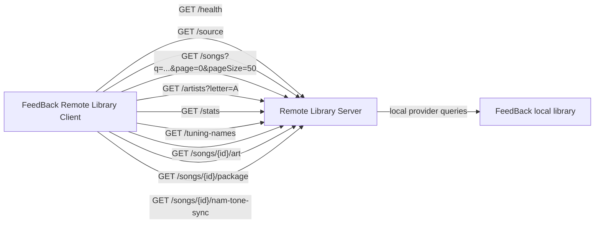

# Remote Library Server

Remote Library Server is a source-side [FeedBack](https://github.com/got-feedback/feedBack) plugin for sharing the current FeedBack local library over a small direct HTTP API. It runs on its own port, separate from FeedBack's main backend, and is designed to be consumed by the [Remote Library Client](https://github.com/Taynavv/feedback-remote-library-client) plugin.

The direct server is a thin wrapper around FeedBack's `local` library provider. It does not build or publish a second catalog of its own; the songs, filters, sort order, artwork, and package downloads reflect what the local FeedBack library provider exposes.

> [!CAUTION]
> **While running, this shares your entire local library with anyone who can reach it.**
> The server hands out song metadata, artwork, and **downloadable original package files** to every
> client that connects (and knows the auth token, if you set one). **It is not designed or intended
> for exposure to the public internet** — it binds to `127.0.0.1` (this machine only) by default for
> exactly that reason. Binding to your LAN (`0.0.0.0`) or forwarding a port exposes your library; if
> you do, **set an auth token, share only with people you trust, and never put it on the open internet
> without a VPN/tunnel and TLS in front of it.** You do this at your own risk — **if you get
> compromised, that is on you, not on this project.** There is no warranty.

## Runtime Model

The plugin declares the core `library` capability as a requester/observer. Its manifest uses `requests` for public library owner commands (`list-providers`, `get-current`, `inspect`) and `observes` for source lifecycle events (`providers-refreshed`, `source-changed`). It uses FeedBack's existing `local` provider through the library provider registry, but it does not own the `library` domain and does not register itself as a `library` provider. The Remote Library Client is the plugin that should appear as a `library` provider when it registers a remote source.

Management stays on the plugin's existing screen and backend routes rather than capability commands. The capability declaration exists so diagnostics and the bundled Capability Inspector show that this server depends on the library surface it wraps.

## What It Does

- Starts a direct library server on a configurable host and port.
- Waits for FeedBack's startup library scan to finish before autostarting, so it does not race the local index.
- Lists local feedpak packages (including legacy `.sloppak`) as remote song summaries using paged provider queries.
- Supports the same core library search/filter/sort parameters used by the client library UI.
- Serves artwork through FeedBack's local provider.
- Serves original package files for remote load/play.
- Optionally shares per-song NAM tone preset mappings, referenced `.nam` models, and IR `.wav` files.
- Exposes artist tree, stats, and tuning-name helper endpoints for the remote Library UI.
- Allows a client plugin to connect by base URL, **or peer-to-peer by a Library ID over iroh** (see below).

## Share over iroh (peer-to-peer, no port forwarding)

For sharing beyond your LAN without touching your router, enable **Share over iroh** in the settings. The server then dials outbound to [iroh](https://www.iroh.computer/)'s relay/discovery network and becomes reachable from anywhere by a **Library ID** — a self-authenticating public key shown on the screen. Copy it to a friend; they add it in **Remote Client → + → Remote Server over iroh**, and everything works exactly as the direct connection (it's the *same* API, tunnelled over an iroh QUIC stream).

- **No port forwarding, no dynamic DNS, no router setup.** iroh connects peers directly (hole-punched) when it can, or via a shared public relay otherwise.
- **This reaches the public internet, regardless of your bind Host.** iroh is public by design: with it on, the `127.0.0.1` default (or any bind address) no longer limits who can reach the library — anyone with the Library ID can. **Set an auth token** (below) unless you're happy for anyone with the ID to browse; the token is the only access control on the iroh path, and it protects that path identically to direct HTTP.
- **The Library ID is stable** (backed by a persistent key stored separately from your settings) and **self-authenticating** — nobody can impersonate your library.
- **Treat the Library ID like a secret URL.** It's a capability: whoever holds it can reach your library (subject to the auth token). Share it only over channels you trust. If it leaks, use **Regenerate ID** on the screen to issue a new one — the old ID stops working, but every current follower has to re-add the new ID. Rotating the auth token likewise cuts off everyone at once.
- **Availability follows your machine:** the library is reachable only while this server is running.
- Requires the `iroh` dependency (in `requirements.txt`, installed by FeedBack on load); it's used only when the toggle is on.

## Install

Remote Library Server is a FeedBack plugin. There are two ways to install it, and the
choice decides how you get updates:

- **From a release (simplest).** Download the latest
  `feedback-remote-library-server-<version>.zip` from the
  [Releases](https://github.com/Taynavv/feedback-remote-library-server/releases) page and
  extract the `feedback-remote-library-server` folder into your FeedBack user-plugins
  directory. Updating later means downloading the newer zip and replacing the folder
  yourself — a zip install is **not** picked up by FeedBack's in-app "Check for Updates".
- **From a git clone (updatable in-app).** Clone this repository into your FeedBack
  user-plugins directory (or clone it elsewhere and symlink/junction it in). Because the
  plugin folder is then a git checkout, FeedBack's plugin manager can update it in place:
  **Check for Updates → Update** runs a `git pull` and applies on the next restart. Track
  the default branch and keep the checkout clean, or the fast-forward-only pull is skipped.

Either way, reload FeedBack afterwards — the plugin appears as **Remote Server** in the
navigation. See the [FeedBack](https://github.com/got-feedback/feedBack) documentation for
where your instance loads plugins from.

## Security

The direct library server has **no authentication by default** and, while running,
serves your entire local library — including original package downloads — to anyone who
can reach its host and port. Configure it accordingly:

- **Default to `127.0.0.1`.** This keeps the server reachable only from the same
  machine. Use it unless another device specifically needs to connect.
- **Binding `0.0.0.0` exposes the library to your whole network.** Only do this on a
  network you trust, and set an auth token. Never expose the port directly to the
  internet — put it behind a VPN or firewall if you need off-LAN access.
- **Auth token (`authToken`).** When set, callers must present it as
  `Authorization: Bearer <token>` (or a `?token=` query parameter on media URLs used in
  ``/download contexts). `GET /health` stays open for liveness checks; every other
  endpoint returns `401` without a valid token. The token is stored in plaintext in the
  plugin's `settings.json`, so protect that file.
- **NAM tone asset sharing is off by default**; when enabled it only exposes the
  model/IR files referenced by a song's own exported tone manifest.

To report a security issue, see [SECURITY.md](SECURITY.md).

## Flow

A client reaches these endpoints either directly (HTTP on the bind host/port) or, when [Share over iroh](#share-over-iroh-peer-to-peer-no-port-forwarding) is on, over an iroh QUIC stream tunnelled to the *same* API — the request set and auth below are identical on both paths.



## API

When the server is running, the client only needs the server base URL, for example `http://127.0.0.1:8765`, or `http://192.168.1.X:8765`.

- `GET /health`
- `GET /source`
- `GET /songs?q=&page=0&pageSize=50&sort=artist&direction=asc`
- `GET /artists?letter=&q=&page=0&pageSize=50`
- `GET /stats?q=&format=&arrangements_has=&stems_has=&has_lyrics=&tunings=`
- `GET /tuning-names`
- `GET /songs/{remoteSongId}/art`
- `GET /songs/{remoteSongId}/package`
- `GET /songs/{remoteSongId}/nam-tone-sync`
- `GET /songs/{remoteSongId}/nam-tone-assets/{model|ir}/{name}`

`/songs` also accepts the legacy cursor form (`cursor=0`) for clients that page by offset. Search/filter parameters include `format`, `arrangements_has`, `arrangements_lacks`, `stems_has`, `stems_lacks`, `has_lyrics`, and `tunings`.

When an `authToken` is configured, every endpoint except `GET /health` requires it as `Authorization: Bearer <token>` or a `?token=` query parameter — see [Security](#security).

The plugin also exposes management endpoints on FeedBack's main backend:

- `GET /api/plugins/remote_library_server/settings`
- `POST /api/plugins/remote_library_server/settings`
- `GET /api/plugins/remote_library_server/status`
- `POST /api/plugins/remote_library_server/start`
- `POST /api/plugins/remote_library_server/stop`
- `POST /api/plugins/remote_library_server/iroh/regenerate-key`
- `GET /api/plugins/remote_library_server/activity`
- `GET /api/plugins/remote_library_server/local-songs`

## Settings

- `enabled`: starts the direct server when the plugin loads.
- `host`: bind host. Use `127.0.0.1` for same-machine access or `0.0.0.0` for LAN access.
- `port`: bind port. Default: `8765`.
- `sourceName`: display name returned by `/source`.
- `authToken`: optional shared secret. When set, clients must present it to reach any endpoint except `/health` (see [Security](#security)). Default: empty (open access).
- `shareNamToneAssets`: allows the direct server to expose NAM Tone Engine preset mappings and referenced model/IR assets for synced songs. Default: `false`.
- `irohEnabled`: also share the server **peer-to-peer over iroh** by a Library ID, with no port forwarding (see [Share over iroh](#share-over-iroh-peer-to-peer-no-port-forwarding)). Default: `false`. (The iroh identity key is stored separately, never in settings.)
- `irohMaxStreams`: cap on concurrent in-flight iroh streams — an abuse limit for the public P2P path. Default: `128` (clamped to 1–4096). Leave it alone unless you have a specific reason.
- `irohIdleTimeout`: seconds before an idle iroh stream is torn down (stops a slow peer from holding slots open). Default: `120` (clamped to 10–3600). Leave it alone unless you have a specific reason.

If `enabled` is true during FeedBack startup, the plugin reports `waitingForScan` and starts the direct server after the local library scan reaches `complete`.

## Notes

- Remote song IDs are URL-safe encoded references to local library-relative filenames.
- Package downloads are resolved back under the configured FeedBack DLC/library root and path-checked before serving.
- NAM tone asset sharing is off by default. When enabled, the server reads `nam_tone.db`, `nam_models/`, and `nam_irs/` directly from the FeedBack config directory and only serves model/IR files referenced by the requested song's exported tone manifest.
- The direct server intentionally relies on FeedBack's local provider instead of rescanning or hashing the library itself.
- Artwork responses are cached by clients and served with a short public cache header.

## Development

```bash
python -m venv .venv

# Windows
.venv/Scripts/pip install pytest fastapi httpx
.venv/Scripts/python -m pytest -q

# macOS / Linux
.venv/bin/pip install pytest fastapi httpx
.venv/bin/python -m pytest -q
```

## Heritage

Remote Library Server is a community port of a plugin originally written by the authors of
[FeedBack](https://github.com/got-feedback/feedBack). Full credit for the original design and
implementation goes to them; this repository — maintained by [@Taynavv](https://github.com/Taynavv)
— is an independent, unofficial port of that work to the current FeedBack plugin API.

If FeedBack's authors would like this repository, I'm glad to hand it over — and if an official
port is published, I'll take this one down.

## AI disclosure, warranty, and contributions

**This port was built with heavy use of AI coding tools.** The large majority of the code here was
written by an AI assistant working under human direction, with human review and hands-on testing
against a real FeedBack install — but you should read it with the same skepticism you'd apply to any
code of unknown provenance.

**There is no warranty.** This is open-source software provided **as-is**, without warranty of any
kind, express or implied — see sections 15 and 16 of the [LICENSE](LICENSE). It opens a network port
and serves your local library to whoever can reach it; if you expose it and get burned, you get to
keep both pieces.

**Contributions are welcome.** If you find a bug or want a feature, open an issue — or better, submit
a pull request. Small, focused PRs with a description of what was tested are the easiest to review. By
contributing you agree your changes are licensed under the same AGPL-3.0 terms.

## License

Copyright (C) 2026 Taynavv and contributors.

AGPL-3.0-or-later — see [LICENSE](LICENSE).